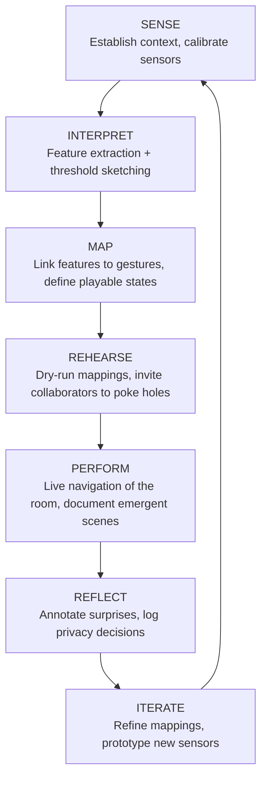

# CONCEPT — Room Lens

**Tagline:** *A site‑sensing instrument that “plays” a room.*

Room Lens lives somewhere between a field recorder, a modular synth, and a diary. Treat this README as a studio notebook: it’s designed to be read with coffee stains on the page and patch cables hanging out of your backpack.

## Intent (why this contraption exists)
- **Listen to place**: translate light, air, presence, and structure into sound behaviors.
- **Reveal scenes**: expose invisible rhythms—HVAC cycles, crowd tides, sun drift—as musical form.
- **Teach mapping**: give learners a rigorous, malleable pipeline from sensing → features → gesture → sound.

## Design constraints (self-imposed guardrails)
- **Scene-first**: mappings are grounded in phenomena, not arbitrary knob twiddling.
- **Low‑friction**: hardware and host can be minimal; OSC/MIDI keeps engines swappable.
- **Ethical by default**: process in RAM; saving requires explicit opt‑in (see PRIVACY_ETHICS).

## Artist lineages & sparks
Here’s who we’re stealing inspiration from—and how their moves show up inside Room Lens. Remix freely.

| Artist / Collective | Signature move | Room Lens translation |
| --- | --- | --- |
| **Annea Lockwood** | Treating rivers and burning pianos as composers. | Use environmental sensors as primary voices; document the room as collaborator, not backdrop. |
| **Ryoji Ikeda** | Surgical data sonification as performance art. | Push sensor features into ultra-precise modulation and spatial flicker. |
| **Pauline Oliveros** | Deep Listening and communal attunement. | Craft ensemble-friendly mappings that reward patience and shared attention. |
| **Suzanne Ciani** | Expressive gestural control with modular synths. | Map multi-dimensional sensor gestures to lush, tactile synthesis engines. |
| **King Tubby & dub engineers** | Live remixing of the sound system itself. | Treat the room’s acoustic feedback paths as playable parameters, automate delays based on occupancy or humidity. |
| **Radical Software collective** | DIY sensing + broadcasting as social practice. | Encourage learners to hack additional sensors, stream OSC to classrooms, and publish process artifacts. |

### Scenes we want to prototype next
- Galleries where lighting rigs modulate drones as visitors wander.
- Classrooms turning HVAC cycles into polyrhythms to teach FFT concepts.
- Community centers using air quality spikes to trigger cautionary sonic motifs.

## Prototyped performance flow (meta view)
Think of this as the bird’s-eye blueprint for how a Room Lens set breathes. Each box is a mindset, not just a module.

### Teaching prompts
- **For students**: ask “what is the room’s hook?” before ever patching audio.
- **For educators**: demo how raw sensor logs become envelopes, triggers, and harmonic shifts.
- **For performers**: script moments to mute the tech and let the room’s natural sound breathe.

## Influences (further reading & listening)
- Acoustic ecology & soundscape composition.
- Data‑driven music (gesture→synthesis mappings).
- Classroom‑friendly instrumentation that invites tinkering.
- Privacy-first interaction design and participatory archiving.
